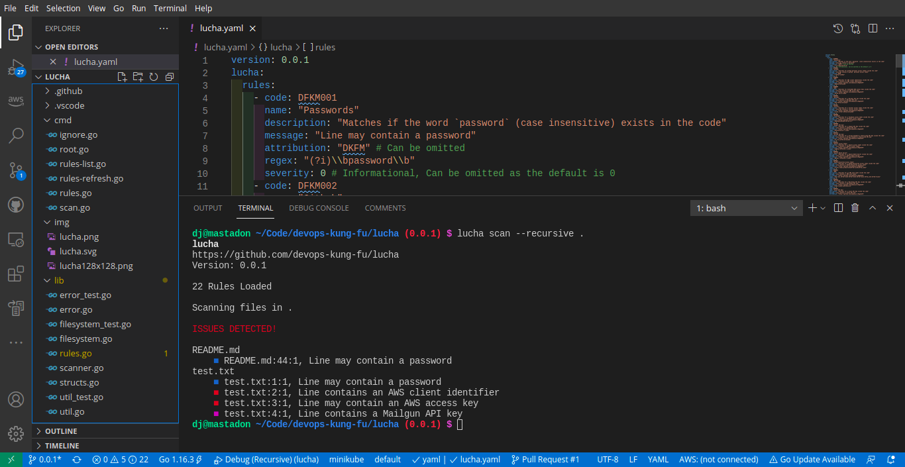

# lucha

 [](https://goreportcard.com/report/github.com/devops-kung-fu/lucha) [](https://codecov.io/gh/devops-kung-fu/lucha) [](lucha-sbom.json)

A CLI that scans for sensitive data in source code

## Overview

If you are scanning for secrets with a GitHub Action on a Pull Request then you're way too late. Your secrets are already in your repository and have polluted your history. Rather than commit secrets in the first place, we developed ```lucha``` to root them out - and when combined with [Hookz](https://github.com/devops-kung-fu/hookz), commits can fail before they are pushed to your remote repository. The best part? This works with any ```git``` based remote as everything happens locally on your machine.

Talk about shifting left, right?

## Lucha in Action

Lucha can run in any terminal and is language agnostic. The following screenshot shows Lucha running inside the Visual Studio Code embedded terminal. Lucha is showing secrets detected in a ```test.txt``` file.



## Secret Detection

```lucha``` contains a number of rules that can detect secrets, keys, and tokens that exist in your codebase. The following list are a number of secrets that ```lucha``` can find:

* Github Personal Access Tokens
* AWS Client Identifiers
* AWS Access Keys
* Mailgun API Keys
* Twitter Access Tokens
* Facebook Access Tokens
* Google API Keys
* Stripe API Keys
* Square Access Tokens
* Square OAuth Secrets
* PayPal/Braintree Access Tokens
* AMS Auth Tokens
* MailChimp API Keys
* Slack API Keys
* Slack Access Tokens
* GCP OAuth2.0 Credentials
* GCP API Keys
* Heroku API Keys
* Artifactory API Token
* Artifactory Password
* Vault Tokens

## Installation


To install ```lucha```,  [download the latest release](https://github.com/devops-kung-fu/hookz/releases) , make is executable, rename it to ```lucha``` and toss it in your ```/usr/local/bin``` directory for Linux, or on your path for other operating systems.

Linux Example:

```bash
sudo chmod +x lucha-0.0.1-linux-amd64
sudo mv lucha-0.0.1-linux-amd64 /usr/local/bin/lucha
```

## Running Lucha

### Setting up Rules

After downloading and installing the ```lucha``` binary, you'll need to grab the latest rules. The easiest way to do this is to run the following:

``` bash
lucha rules refresh
```
This command may be run at any time.

Alternately, you can manually create or download rules for ```lucha``` and reference them with the ```--rules-file``` flag.

``` bash
lucha scan --recursive --rules-file rules.yaml .
```

### Listing current Rules and Descriptions

To see information about what rules ```lucha``` is scanning for, use the ```lucha rules list``` command. This will also tell you the version of your rules file.

### Scanning

Scanning can be done with the following simple command which will scan the current and all sub-directories for sensitive data:

``` bash
lucha scan --recursive .
```
For more options, run ```lucha scan --help```.

### Hooks
The recommended way to run Lucha is to configure [Hookz](https://github.com/devops-kung-fu/hookz) to run it during every commit from a client machine. Using ```Hooks``` just add the following as an action:

``` yaml
        - name: "lucha: scan source code for sensitive data"
          exec: lucha
          args: ["scan", "--recursive", "."]
```
### No Fail

It's strongly recommended that you **never** use this flag, but it may come in handy in your CI/CD environment. **USE AT YOUR OWN DISCRETION**

## Results

When ```lucha``` returns results they will be sorted by file name and issues. Each issue has a color indicator, the name of the file with issues, the line number, and the description of the violation. If you are using Visual Studio Code, you can simply CTRL-click on the file:line:1 string to open the editor to the line containing the violation.

There are 5 status colors and severities that ```lucha``` may display. Their meaning is as follows:

| Color   | Severity          |
| ------- | ----------------- |
| Blue    | 0 - Informational |
| Cyan    | 1 - Low           |
| Yellow  | 2 - Medium        |
| Magenta | 3 - High          |
| Red     | 4 - Critical      |


## Ignoring Files
You may want to ignore files that are show false positives. For example in Go, ```lucha``` will show that there may be AWS Keys in the ```go.mod``` file. To ignore any file you can use ```lucha ignore [filename]``` which will create a file named ```.luchaignore```, or create a ```.luchaignore``` file in the root of your repository with the names or paths to ignore. 

The ```.luchaignore``` file can be and should be checked in with your code.

## What's with the name Lucha?

```Lucha``` is the Spanish word for fight, or struggle. We're not sure why [DJ Schleen](https://github.com/djschleen) chose ```lucha``` but it is a struggle to find passwords and API Keys in code, and if the Security team finds them exposed in a public repository then you're in for a fight. 

Maybe he just likes wrestling. Ping him on [Twitter](https://twitter.com/djschleen).

## Software Bill of Materials

```lucha``` uses [Hookz](https://github.com/devops-kung-fu/hookz) and CycloneDX to generate a Software Bill of Materials in CycloneDX format every time a developer commits code to this repository. More information for CycloneDX is available [here](https://cyclonedx.org)

The current SBoM for ```lucha``` is available [here](lucha-sbom.json).

## Credits

A big thank-you to our friends at [Freepik](https://www.freepik.com) for the ```lucha``` logo.
